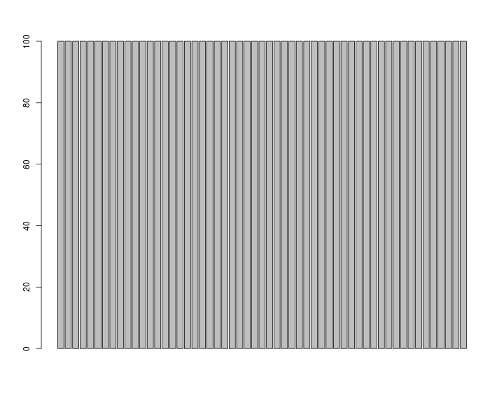
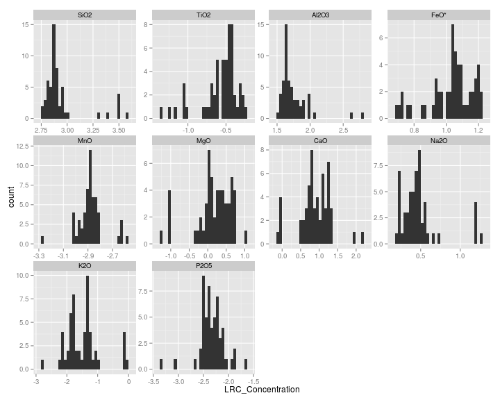
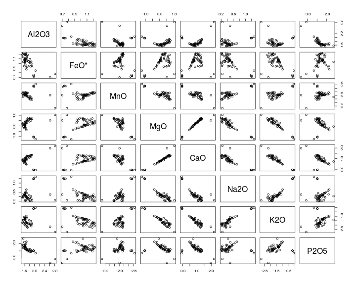
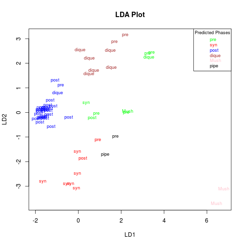
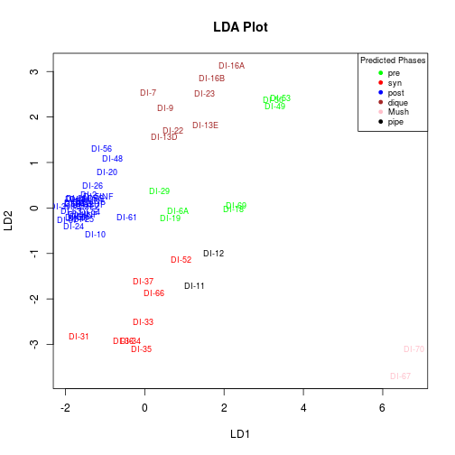
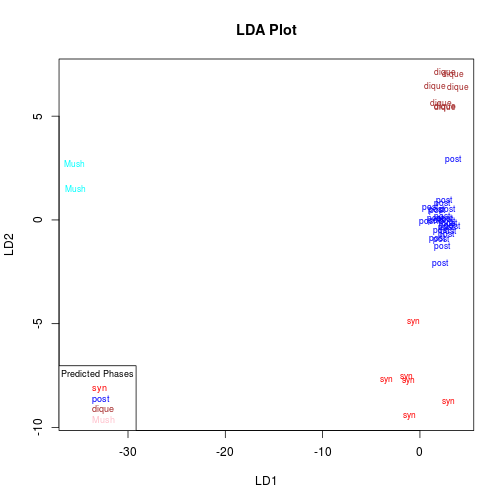
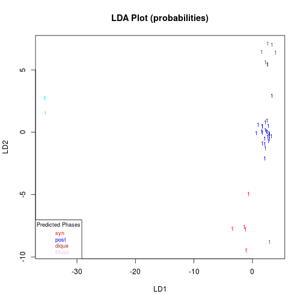
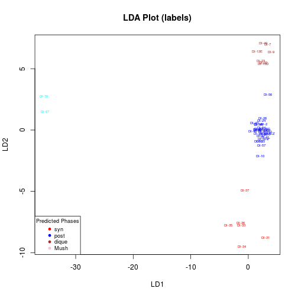
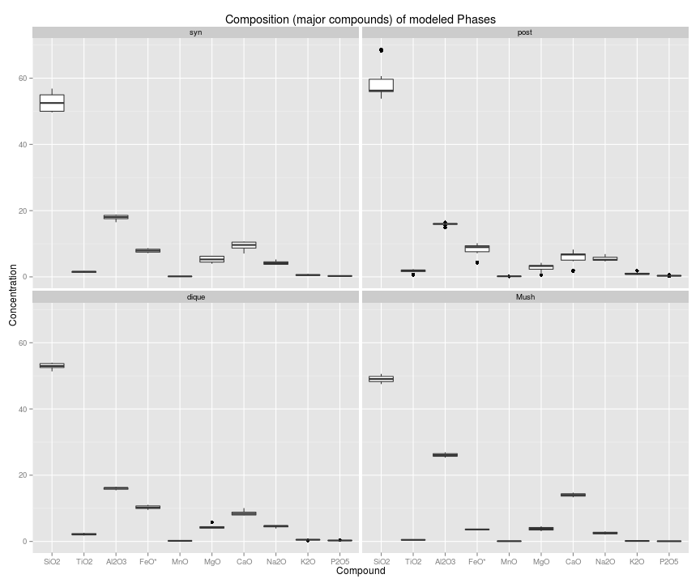
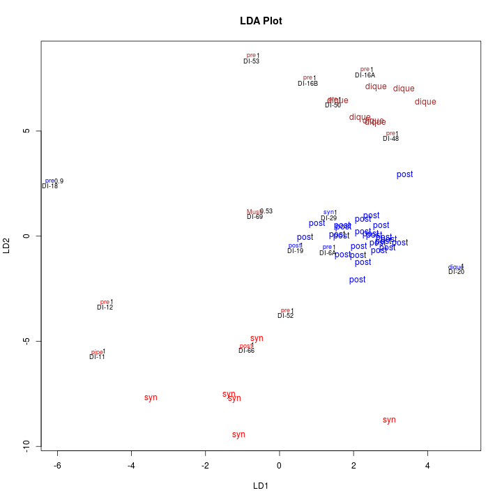

Discriminant Analysis of Geochemical composition vs. Eruption Phase (IIa)
========================================================================
Major compounds Decepcion Island (Adelina Geyer 2014)
-------------------------------

* Agustin.Lobo@ictja.csic.es
* Data by ageyertraver@gmail.com
* 20160721

**Goal: do samples defined by their geochemical composition cluster according to field-diagnosed eruption phase?**


```r
knitr::opts_chunk$set(fig.path='figure/decepcionADE_major-')
require(MASS)
require(ggplot2)
require(reshape2)
require(plyr)
require(scales)
require(robCompositions)
require(subselect)

rwd <- "/media/alobo/LACIE500/Adelina/GQDecepcion/RGQDecepcion"
dirdata1 <- "/media/alobo/LACIE500/Adelina/GQDecepcion/GQDecepcionData"
```

## 1. Data handling
### 1.1 Data reading


```r
decepade.ori <- read.csv(file.path(dirdata1,"resultados_analiticos_Decepcion.csv"),header=TRUE,stringsAsFactors = FALSE)
head(decepade.ori,1)
```

```
##   Muestra      x       y  fase SiO2  TiO2 Al2O3  FeO.   MnO  MgO  CaO Na2O
## 1    DI-7 616577 3014630 dique 52.3 2.583 15.24 10.83 0.192 3.97 7.86 4.76
##    K2O  P2O5   Sum LOI.... SiO2.N TiO2.1 Al2O3.1 FeO..1 MnO.1 MgO.1 CaO.1
## 1 0.58 0.413 98.74   -0.36  52.97  2.616   15.44  10.97 0.195  4.02  7.96
##   Na2O.1 K2O.1 P2O5.1 Total Na.KO Ni Cr Sc   V Ba Rb  Sr  Zr  Y  Nb Ga Cu
## 1   4.82  0.59  0.419   100  5.41 10  3 31 335 96  7 367 205 40 7.9 21 46
##   Zn Pb La Ce Th Nd U La.ppm Ce.ppm Pr.ppm Nd.ppm Sm.ppm Eu.ppm Gd.ppm
## 1 94  3 12 28  1 21 1  12.54  32.02   4.71   22.2   6.27   2.23    7.2
##   Tb.ppm Dy.ppm Ho.ppm Er.ppm Tm.ppm Yb.ppm Lu.ppm Ba.ppm Th.ppm Nb.ppm
## 1   1.25   7.75   1.58   4.24    0.6   3.62   0.58     93   1.25   6.79
##   Y.ppm Hf.ppm Ta.ppm U.ppm Pb.ppm Rb.ppm Cs.ppm Sr.ppm Sc.ppm Zr.ppm
## 1 40.14   4.77   0.51  0.39    3.3    6.9   0.41    372   31.8    204
```

```r
names(decepade.ori)
```

```
##  [1] "Muestra" "x"       "y"       "fase"    "SiO2"    "TiO2"    "Al2O3"  
##  [8] "FeO."    "MnO"     "MgO"     "CaO"     "Na2O"    "K2O"     "P2O5"   
## [15] "Sum"     "LOI...." "SiO2.N"  "TiO2.1"  "Al2O3.1" "FeO..1"  "MnO.1"  
## [22] "MgO.1"   "CaO.1"   "Na2O.1"  "K2O.1"   "P2O5.1"  "Total"   "Na.KO"  
## [29] "Ni"      "Cr"      "Sc"      "V"       "Ba"      "Rb"      "Sr"     
## [36] "Zr"      "Y"       "Nb"      "Ga"      "Cu"      "Zn"      "Pb"     
## [43] "La"      "Ce"      "Th"      "Nd"      "U"       "La.ppm"  "Ce.ppm" 
## [50] "Pr.ppm"  "Nd.ppm"  "Sm.ppm"  "Eu.ppm"  "Gd.ppm"  "Tb.ppm"  "Dy.ppm" 
## [57] "Ho.ppm"  "Er.ppm"  "Tm.ppm"  "Yb.ppm"  "Lu.ppm"  "Ba.ppm"  "Th.ppm" 
## [64] "Nb.ppm"  "Y.ppm"   "Hf.ppm"  "Ta.ppm"  "U.ppm"   "Pb.ppm"  "Rb.ppm" 
## [71] "Cs.ppm"  "Sr.ppm"  "Sc.ppm"  "Zr.ppm"
```

```r
names(decepade.ori)[1:4] <- c("Sample","Longitude","Latitude","Phase")
decepade.ori$Longitude <- -decepade.ori$Longitude
decepade.ori$Latitude  <- -decepade.ori$Latitude
names(decepade.ori)[16] <- "LOI"
names(decepade.ori)[c(8,20)] <- "FeO*"
table(decepade.ori$Phase)
```

```
## 
## dique  Mush  pipe  post   pre   syn 
##     8     3     1    27     9     7
```

```r
decepade.ori$Phase <- factor(decepade.ori$Phase,levels=c("pre","syn","post","dique","Mush","pipe"))
```

Check percentages were calculated without LOI


```r
a.suma <- apply(decepade.ori[,5:14],1,sum)
a.suma
```

```
##  [1]  98.728  98.603  98.176  99.336  98.422  97.398  97.722  85.941
##  [9]  98.288  98.976  99.849  98.463  98.328  98.431  98.060  98.845
## [17]  98.446  98.150  99.261  98.405  99.854  98.831  99.849 100.550
## [25]  99.702 100.188  99.590 100.099  98.550  99.868  99.409  99.490
## [33]  99.176  99.866  98.484  99.327  99.761  99.535  99.598  98.371
## [41]  97.411  96.954  94.797  94.746  96.305  96.694  98.980  95.158
## [49]  98.109  97.899 100.595  99.490  99.359  98.812  95.985
```

```r
a.percent <- decepade.ori[,5:14]*100/t(a.suma)
a.percent[1:3,]
```

```
##       SiO2     TiO2    Al2O3     FeO*       MnO      MgO      CaO     Na2O
## 1 52.97383 2.616279 15.43635 10.96953 0.1944737 4.021149 7.961267 4.821327
## 2 52.57447 2.434003 15.50663 11.05443 0.1937061 4.300072 8.356744 4.705739
## 3 53.62818 1.952616 16.24633  9.74780 0.1792699 4.328960 8.556063 4.634534
##         K2O      P2O5
## 1 0.5874727 0.4183210
## 2 0.5375090 0.3367038
## 3 0.4583605 0.2678862
```

```r
decepade.ori[1:3,17:26]
```

```
##   SiO2.N TiO2.1 Al2O3.1  FeO* MnO.1 MgO.1 CaO.1 Na2O.1 K2O.1 P2O5.1
## 1  52.97  2.616   15.44 10.97 0.195  4.02  7.96   4.82  0.59  0.419
## 2  52.57  2.434   15.51 11.05 0.194  4.30  8.36   4.70  0.54  0.337
## 3  53.64  1.953   16.24  9.75 0.180  4.32  8.56   4.63  0.46  0.268
```

```r
dim(decepade.ori)
```

```
## [1] 55 74
```

```r
cbind(1:ncol(decepade.ori),names(decepade.ori))
```

```
##       [,1] [,2]       
##  [1,] "1"  "Sample"   
##  [2,] "2"  "Longitude"
##  [3,] "3"  "Latitude" 
##  [4,] "4"  "Phase"    
##  [5,] "5"  "SiO2"     
##  [6,] "6"  "TiO2"     
##  [7,] "7"  "Al2O3"    
##  [8,] "8"  "FeO*"     
##  [9,] "9"  "MnO"      
## [10,] "10" "MgO"      
## [11,] "11" "CaO"      
## [12,] "12" "Na2O"     
## [13,] "13" "K2O"      
## [14,] "14" "P2O5"     
## [15,] "15" "Sum"      
## [16,] "16" "LOI"      
## [17,] "17" "SiO2.N"   
## [18,] "18" "TiO2.1"   
## [19,] "19" "Al2O3.1"  
## [20,] "20" "FeO*"     
## [21,] "21" "MnO.1"    
## [22,] "22" "MgO.1"    
## [23,] "23" "CaO.1"    
## [24,] "24" "Na2O.1"   
## [25,] "25" "K2O.1"    
## [26,] "26" "P2O5.1"   
## [27,] "27" "Total"    
## [28,] "28" "Na.KO"    
## [29,] "29" "Ni"       
## [30,] "30" "Cr"       
## [31,] "31" "Sc"       
## [32,] "32" "V"        
## [33,] "33" "Ba"       
## [34,] "34" "Rb"       
## [35,] "35" "Sr"       
## [36,] "36" "Zr"       
## [37,] "37" "Y"        
## [38,] "38" "Nb"       
## [39,] "39" "Ga"       
## [40,] "40" "Cu"       
## [41,] "41" "Zn"       
## [42,] "42" "Pb"       
## [43,] "43" "La"       
## [44,] "44" "Ce"       
## [45,] "45" "Th"       
## [46,] "46" "Nd"       
## [47,] "47" "U"        
## [48,] "48" "La.ppm"   
## [49,] "49" "Ce.ppm"   
## [50,] "50" "Pr.ppm"   
## [51,] "51" "Nd.ppm"   
## [52,] "52" "Sm.ppm"   
## [53,] "53" "Eu.ppm"   
## [54,] "54" "Gd.ppm"   
## [55,] "55" "Tb.ppm"   
## [56,] "56" "Dy.ppm"   
## [57,] "57" "Ho.ppm"   
## [58,] "58" "Er.ppm"   
## [59,] "59" "Tm.ppm"   
## [60,] "60" "Yb.ppm"   
## [61,] "61" "Lu.ppm"   
## [62,] "62" "Ba.ppm"   
## [63,] "63" "Th.ppm"   
## [64,] "64" "Nb.ppm"   
## [65,] "65" "Y.ppm"    
## [66,] "66" "Hf.ppm"   
## [67,] "67" "Ta.ppm"   
## [68,] "68" "U.ppm"    
## [69,] "69" "Pb.ppm"   
## [70,] "70" "Rb.ppm"   
## [71,] "71" "Cs.ppm"   
## [72,] "72" "Sr.ppm"   
## [73,] "73" "Sc.ppm"   
## [74,] "74" "Zr.ppm"
```

```r
decepade <- decepade.ori[,c(1:14,28:74)]
decepade[,5:14] <- a.percent
options(width=180)
head(decepade,1)
```

```
##   Sample Longitude Latitude Phase     SiO2     TiO2    Al2O3     FeO*       MnO      MgO      CaO     Na2O       K2O     P2O5 Na.KO Ni Cr Sc   V Ba Rb  Sr  Zr  Y  Nb Ga Cu Zn Pb
## 1   DI-7   -616577 -3014630 dique 52.97383 2.616279 15.43635 10.96953 0.1944737 4.021149 7.961267 4.821327 0.5874727 0.418321  5.41 10  3 31 335 96  7 367 205 40 7.9 21 46 94  3
##   La Ce Th Nd U La.ppm Ce.ppm Pr.ppm Nd.ppm Sm.ppm Eu.ppm Gd.ppm Tb.ppm Dy.ppm Ho.ppm Er.ppm Tm.ppm Yb.ppm Lu.ppm Ba.ppm Th.ppm Nb.ppm Y.ppm Hf.ppm Ta.ppm U.ppm Pb.ppm Rb.ppm
## 1 12 28  1 21 1  12.54  32.02   4.71   22.2   6.27   2.23    7.2   1.25   7.75   1.58   4.24    0.6   3.62   0.58     93   1.25   6.79 40.14   4.77   0.51  0.39    3.3    6.9
##   Cs.ppm Sr.ppm Sc.ppm Zr.ppm
## 1   0.41    372   31.8    204
```

```r
summary(decepade)
```

```
##     Sample            Longitude          Latitude          Phase         SiO2            TiO2            Al2O3            FeO*             MnO               MgO        
##  Length:55          Min.   :-624494   Min.   :-3021349   pre  : 9   Min.   :47.51   Min.   :0.4192   Min.   :14.85   Min.   : 3.520   Min.   :0.06206   Min.   :0.5507  
##  Class :character   1st Qu.:-620047   1st Qu.:-3018885   syn  : 7   1st Qu.:52.45   1st Qu.:1.5107   1st Qu.:15.95   1st Qu.: 7.774   1st Qu.:0.15047   1st Qu.:3.2150  
##  Mode  :character   Median :-617160   Median :-3014741   post :27   Median :54.42   Median :1.8760   Median :16.16   Median : 8.925   Median :0.17323   Median :3.9735  
##                     Mean   :-618262   Mean   :-3016014   dique: 8   Mean   :55.46   Mean   :1.7359   Mean   :16.75   Mean   : 8.407   Mean   :0.16558   Mean   :3.8441  
##                     3rd Qu.:-616082   3rd Qu.:-3014031   Mush : 3   3rd Qu.:56.38   3rd Qu.:2.0344   3rd Qu.:16.71   3rd Qu.: 9.482   3rd Qu.:0.17835   3rd Qu.:4.8629  
##                     Max.   :-614727   Max.   :-3012506   pipe : 1   Max.   :68.73   Max.   :2.6163   Max.   :26.92   Max.   :11.054   Max.   :0.19729   Max.   :6.3624  
##       CaO              Na2O            K2O              P2O5            Na.KO             Ni             Cr               Sc              V               Ba              Rb       
##  Min.   : 1.774   Min.   :2.065   Min.   :0.1017   Min.   :0.0661   Min.   :2.170   Min.   : 1.0   Min.   :  0.00   Min.   :10.00   Min.   :  6.0   Min.   : 36.0   Min.   : 1.00  
##  1st Qu.: 6.725   1st Qu.:4.089   1st Qu.:0.4718   1st Qu.:0.2421   1st Qu.:4.550   1st Qu.: 6.0   1st Qu.:  2.00   1st Qu.:23.00   1st Qu.:201.5   1st Qu.: 93.5   1st Qu.: 5.00  
##  Median : 7.923   Median :4.821   Median :0.6438   Median :0.2956   Median :5.410   Median : 9.0   Median : 11.00   Median :26.00   Median :251.0   Median :110.0   Median : 8.00  
##  Mean   : 7.770   Mean   :4.814   Mean   :0.7511   Mean   :0.2993   Mean   :5.565   Mean   :16.4   Mean   : 43.27   Mean   :25.33   Mean   :226.5   Mean   :124.1   Mean   :10.15  
##  3rd Qu.: 9.781   3rd Qu.:5.206   3rd Qu.:0.8627   3rd Qu.:0.3503   3rd Qu.:6.025   3rd Qu.:24.0   3rd Qu.: 64.50   3rd Qu.:30.00   3rd Qu.:272.0   3rd Qu.:141.0   3rd Qu.:12.00  
##  Max.   :14.742   Max.   :6.884   Max.   :1.8662   Max.   :0.6446   Max.   :8.740   Max.   :66.0   Max.   :268.00   Max.   :36.00   Max.   :553.0   Max.   :262.0   Max.   :29.00  
##        Sr              Zr              Y               Nb               Ga              Cu               Zn               Pb               La              Ce       
##  Min.   :129.0   Min.   : 36.0   Min.   : 7.00   Min.   : 1.300   Min.   :15.00   Min.   :  4.00   Min.   : 24.00   Min.   : 1.000   Min.   : 4.00   Min.   : 6.00  
##  1st Qu.:343.0   1st Qu.:170.5   1st Qu.:31.50   1st Qu.: 6.500   1st Qu.:18.50   1st Qu.: 38.00   1st Qu.: 74.50   1st Qu.: 3.000   1st Qu.: 9.50   1st Qu.:26.50  
##  Median :357.0   Median :213.0   Median :39.00   Median : 8.200   Median :20.00   Median : 48.00   Median : 92.00   Median : 4.000   Median :12.00   Median :32.00  
##  Mean   :360.0   Mean   :234.6   Mean   :38.24   Mean   : 8.069   Mean   :19.47   Mean   : 45.56   Mean   : 84.07   Mean   : 4.509   Mean   :13.56   Mean   :33.65  
##  3rd Qu.:404.5   3rd Qu.:259.5   3rd Qu.:42.50   3rd Qu.: 9.200   3rd Qu.:21.00   3rd Qu.: 58.50   3rd Qu.: 94.00   3rd Qu.: 5.000   3rd Qu.:17.00   3rd Qu.:38.50  
##  Max.   :596.0   Max.   :513.0   Max.   :64.00   Max.   :14.800   Max.   :22.00   Max.   :101.00   Max.   :102.00   Max.   :10.000   Max.   :27.00   Max.   :61.00  
##        Th              Nd              U              La.ppm          Ce.ppm          Pr.ppm          Nd.ppm          Sm.ppm          Eu.ppm          Gd.ppm          Tb.ppm     
##  Min.   :0.000   Min.   : 5.00   Min.   :0.0000   Min.   : 3.11   Min.   : 7.26   Min.   :0.990   Min.   : 4.35   Min.   :1.090   Min.   :0.530   Min.   :1.230   Min.   :0.210  
##  1st Qu.:1.000   1st Qu.:17.50   1st Qu.:0.0000   1st Qu.:10.27   1st Qu.:25.59   1st Qu.:3.715   1st Qu.:17.02   1st Qu.:4.710   1st Qu.:1.690   1st Qu.:5.350   1st Qu.:0.940  
##  Median :2.000   Median :22.00   Median :1.0000   Median :12.92   Median :32.27   Median :4.710   Median :21.90   Median :5.900   Median :2.020   Median :6.660   Median :1.160  
##  Mean   :2.036   Mean   :21.85   Mean   :0.7273   Mean   :13.82   Mean   :33.97   Mean   :4.819   Mean   :21.59   Mean   :5.828   Mean   :1.916   Mean   :6.492   Mean   :1.136  
##  3rd Qu.:2.000   3rd Qu.:25.00   3rd Qu.:1.0000   3rd Qu.:15.27   3rd Qu.:37.48   3rd Qu.:5.319   3rd Qu.:23.90   3rd Qu.:6.402   3rd Qu.:2.159   3rd Qu.:7.218   3rd Qu.:1.260  
##  Max.   :5.000   Max.   :35.00   Max.   :2.0000   Max.   :26.56   Max.   :62.68   Max.   :8.450   Max.   :35.64   Max.   :9.090   Max.   :2.600   Max.   :9.586   Max.   :1.748  
##      Dy.ppm           Ho.ppm          Er.ppm          Tm.ppm           Yb.ppm          Lu.ppm           Ba.ppm          Th.ppm          Nb.ppm           Y.ppm      
##  Min.   : 1.280   Min.   :0.270   Min.   :0.730   Min.   :0.1000   Min.   :0.650   Min.   :0.1000   Min.   : 31.0   Min.   :0.340   Min.   : 1.350   Min.   : 6.85  
##  1st Qu.: 5.880   1st Qu.:1.200   1st Qu.:3.310   1st Qu.:0.4700   1st Qu.:2.930   1st Qu.:0.4600   1st Qu.: 90.0   1st Qu.:1.105   1st Qu.: 5.235   1st Qu.:30.47  
##  Median : 7.340   Median :1.510   Median :4.108   Median :0.6000   Median :3.620   Median :0.5753   Median :105.1   Median :1.440   Median : 6.880   Median :38.06  
##  Mean   : 7.164   Mean   :1.487   Mean   :4.072   Mean   :0.5925   Mean   :3.681   Mean   :0.5750   Mean   :120.2   Mean   :1.756   Mean   : 7.092   Mean   :37.62  
##  3rd Qu.: 7.860   3rd Qu.:1.636   3rd Qu.:4.469   3rd Qu.:0.6532   3rd Qu.:4.033   3rd Qu.:0.6308   3rd Qu.:134.4   3rd Qu.:1.970   3rd Qu.: 7.970   3rd Qu.:41.29  
##  Max.   :11.270   Max.   :2.422   Max.   :6.790   Max.   :1.0317   Max.   :6.625   Max.   :1.0500   Max.   :261.0   Max.   :4.650   Max.   :13.920   Max.   :61.82  
##      Hf.ppm           Ta.ppm           U.ppm            Pb.ppm           Rb.ppm           Cs.ppm           Sr.ppm          Sc.ppm          Zr.ppm     
##  Min.   : 0.900   Min.   :0.0900   Min.   :0.1100   Min.   : 1.030   Min.   : 0.700   Min.   :0.0300   Min.   :132.0   Min.   : 9.30   Min.   : 35.0  
##  1st Qu.: 3.890   1st Qu.:0.3900   1st Qu.:0.3100   1st Qu.: 2.985   1st Qu.: 4.600   1st Qu.:0.2300   1st Qu.:344.6   1st Qu.:23.23   1st Qu.:167.5  
##  Median : 4.920   Median :0.5100   Median :0.4100   Median : 3.840   Median : 7.741   Median :0.4500   Median :358.2   Median :26.30   Median :209.0  
##  Mean   : 5.412   Mean   :0.5193   Mean   :0.5066   Mean   : 4.487   Mean   : 9.717   Mean   :0.5356   Mean   :363.1   Mean   :25.57   Mean   :232.8  
##  3rd Qu.: 5.924   3rd Qu.:0.5853   3rd Qu.:0.5700   3rd Qu.: 5.129   3rd Qu.:11.716   3rd Qu.:0.7062   3rd Qu.:402.5   3rd Qu.:30.75   3rd Qu.:254.1  
##  Max.   :12.020   Max.   :1.0100   Max.   :1.3400   Max.   :10.358   Max.   :29.297   Max.   :1.7158   Max.   :597.0   Max.   :35.50   Max.   :525.0
```

```r
options(width=80)
```

### 1.2 Data transformation: Centered Log-Ratio


```r
barplot(apply(decepade[,5:14],1,sum))
```

 

```r
decepade.cenLR <- cenLR(decepade[,5:14])
decepadecen <- decepade[,1:14]
decepadecen[,5:14] <- decepade.cenLR$x.clr
head(decepadecen,1)
```

```
##   Sample Longitude Latitude Phase     SiO2       TiO2    Al2O3    FeO*      MnO
## 1   DI-7   -616577 -3014630 dique 2.763627 -0.2444182 1.530554 1.18895 -2.84363
##         MgO       CaO     Na2O       K2O      P2O5
## 1 0.1853964 0.8684169 0.366878 -1.738097 -2.077677
```

```r
decepadecen.melt <- melt(decepadecen,id=1:4,variable.name="Compound",value.name="LRC_Concentration")
head(decepadecen.melt,10)
```

```
##    Sample Longitude Latitude Phase Compound LRC_Concentration
## 1    DI-7   -616577 -3014630 dique     SiO2          2.763627
## 2    DI-9   -616659 -3014432 dique     SiO2          2.784673
## 3  DI-13E   -615927 -3016139 dique     SiO2          2.877524
## 4  DI-13D   -615927 -3016139 dique     SiO2          2.860052
## 5   DI-20   -615626 -3016371 dique     SiO2          2.905471
## 6   DI-22   -615639 -3016390 dique     SiO2          2.856397
## 7   DI-23   -615637 -3016434 dique     SiO2          2.821196
## 8   DI-49   -624081 -3013413 dique     SiO2          2.870585
## 9   DI-67   -614727 -3019246  Mush     SiO2          3.376769
## 10  DI-69   -614732 -3019248  Mush     SiO2          2.940840
```

```r
ggplot(data=decepadecen.melt) +
    geom_histogram(aes(x=LRC_Concentration)) +
    facet_wrap(~Compound,scales="free")
```

```
## stat_bin: binwidth defaulted to range/30. Use 'binwidth = x' to adjust this.
## stat_bin: binwidth defaulted to range/30. Use 'binwidth = x' to adjust this.
## stat_bin: binwidth defaulted to range/30. Use 'binwidth = x' to adjust this.
## stat_bin: binwidth defaulted to range/30. Use 'binwidth = x' to adjust this.
## stat_bin: binwidth defaulted to range/30. Use 'binwidth = x' to adjust this.
## stat_bin: binwidth defaulted to range/30. Use 'binwidth = x' to adjust this.
## stat_bin: binwidth defaulted to range/30. Use 'binwidth = x' to adjust this.
## stat_bin: binwidth defaulted to range/30. Use 'binwidth = x' to adjust this.
## stat_bin: binwidth defaulted to range/30. Use 'binwidth = x' to adjust this.
## stat_bin: binwidth defaulted to range/30. Use 'binwidth = x' to adjust this.
```

 

```r
pairs(decepadecen[,-(1:6)])
```

 

## 2. LDA of Major Compounds (all Phases considered)


```r
decepadecen.lda <- lda(decepadecen[,5:14], grouping=decepadecen$Phase)
```

```
## Warning in lda.default(x, grouping, ...): variables are collinear
```

```r
decepadecen.pc <- prcomp(decepadecen[,5:14])$x
decepadecen.lda <- lda(decepadecen.pc[,-10], grouping=decepadecen$Phase)
decepadecen.lda <- lda(decepadecen.pc[,-10], grouping=decepadecen$Phase)
decepadecen.ldaclas <- predict(decepadecen.lda)$class
decepadecen.ldc <- predict(decepadecen.lda)$x
table(decepadecen$Phase)
```

```
## 
##   pre   syn  post dique  Mush  pipe 
##     9     7    27     8     3     1
```

```r
adecolorines <- as.character(mapvalues(decepadecen.ldaclas,from=c("pre","syn","post","dique","Mush","pipe"),
                                    to=c("green","red","blue","brown","pink","black")))
```

```r
#bmp("adeLDAmajor1.bmp",width=969,height=800)
plot(decepadecen.ldc, type="n", ,main="LDA Plot")
text(decepadecen.ldc,col=adecolorines, labels =decepadecen$Phase, cex=0.75)
legend("topright",title="Predicted Phases",title.col="black",
       legend=c("pre","syn","post","dique","Mush","pipe"),
       text.col=c("green","red","blue","brown","pink","black")
       ,cex=0.75)
#dev.off()
#bmp("adeLDAmajor2.bmp",width=969,height=800)
plot(decepadecen.ldc,col=adecolorines,pch=" ",main="LDA Plot")
text(decepadecen.ldc,col=adecolorines, labels =decepadecen$Sample, cex=0.75)
legend("topright",title="Predicted Phases",title.col="black",
       legend=c("pre","syn","post","dique","Mush","pipe"), 
       pch=19,col=c("green","red","blue","brown","pink","black"),bty="o",cex=0.75)
#dev.off()
```



## 2. LDA of Major Compounds (Phases pre and pipe discarded at model fit )
We exclude from the model:

* All "pre", as they do not cluster at all (they cannot be considered a group in GQ terms)
* DI-48: conflicting diagnostic ("pre" for some authors, "post" for some others)
* DI-66: early phase? weird as "post" in any case
* All samples classified with a prob < 0.95

All samples will be reprojected to the LDA space to assess where thy go


```r
decepadecen$sel <- 1
decepadecen$sel[decepadecen$Phase=="pre" | decepadecen$Phase== "pipe"] <- 0
decepadecen$sel[decepadecen$Sample=="DI-48"] <- 0
decepadecen$sel[decepadecen$Sample=="DI-66"] <- 0
decepadecensel <- decepadecen[decepadecen$sel==1,]
decepadecensel$Phase <- droplevels(decepadecensel$Phase)
decepadecensel.lda <- lda(decepadecen.pc[decepadecen$sel==1,-10], grouping=decepadecensel$Phase)
decepadecensel.ldaclas <- predict(decepadecensel.lda)$class
decepadecensel.ldc <- predict(decepadecensel.lda)$x
decepadecensel.ldp <- predict(decepadecensel.lda)$posterior
decepadecensel.ldp <- apply(decepadecensel.ldp,1,max)
```

Now we discard samples classified with prob<0.95


```r
decepadecensel$sel[decepadecensel.ldp<0.95] <-0
bad <- decepadecensel$Sample[decepadecensel.ldp<0.95]
exclude <- decepadecen$Sample%in%bad
decepadecen$sel[exclude] <-0 #we need this to keep a record of all excluded samples
decepadecensel <- decepadecen[decepadecen$sel==1,]
decepadecensel$Phase <- droplevels(decepadecensel$Phase)
```

And repeat the lda:


```r
decepadecensel.lda <- lda(decepadecen.pc[decepadecen$sel==1,-10], grouping=decepadecensel$Phase)
decepadecensel.ldaclas <- predict(decepadecensel.lda)$class
decepadecensel.ldc <- predict(decepadecensel.lda)$x
decepadecensel.ldp <- predict(decepadecensel.lda)$posterior
decepadecensel.ldp <- apply(decepadecensel.ldp,1,max)
table(decepadecensel$Phase)
```

```
## 
##   syn  post dique  Mush 
##     6    25     7     2
```

```r
adecolorines2 <- as.character(mapvalues(decepadecensel.ldaclas,from=c("syn","post","dique","Mush"),
                                       to=c("red","blue","brown","cyan")))
```

```r
#bmp("adeLDAmajor1.bmp",width=969,height=800)
plot(decepadecensel.ldc, type="n", ,main="LDA Plot")
text(decepadecensel.ldc,col=adecolorines2, labels =decepadecensel$Phase, cex=0.7)
legend("bottomleft",title="Predicted Phases",title.col="black",
       legend=c("syn","post","dique","Mush"),
       text.col=c("red","blue","brown","pink")
       ,cex=0.75)
#dev.off()
plot(decepadecensel.ldc, type="n", ,main="LDA Plot (probabilities)")
text(decepadecensel.ldc,col=adecolorines2, labels = round(decepadecensel.ldp,2), cex=0.7)
legend("bottomleft",title="Predicted Phases",title.col="black",
       legend=c("syn","post","dique","Mush"),
       text.col=c("red","blue","brown","pink")
       ,cex=0.75)
#dev.off()
#bmp("adeLDAmajor2.bmp",width=969,height=800)
plot(decepadecensel.ldc,col=adecolorines2,pch=" ",main="LDA Plot (labels)")
text(decepadecensel.ldc,col=adecolorines2, labels =decepadecensel$Sample, cex=0.5)
legend("bottomleft",title="Predicted Phases",title.col="black",
       legend=c("syn","post","dique","Mush"), 
       pch=19,col=c("red","blue","brown","pink"),bty="o",cex=0.75)
#dev.off()
```



### 3.2. Composition of Phases


```r
decepadesel <- decepade[decepadecen$sel==1,c(1:4,5:14)] 
decepadesel$class <- decepadecensel.ldaclas
decepadesel.melt <- melt(decepadesel,id=c(1:4,15),variable.name="Compound",value.name="Concentration")
head(decepadesel.melt,3)
```

```
##   Sample Longitude Latitude Phase class Compound Concentration
## 1   DI-7   -616577 -3014630 dique dique     SiO2      52.97383
## 2   DI-9   -616659 -3014432 dique dique     SiO2      52.57447
## 3 DI-13E   -615927 -3016139 dique dique     SiO2      53.62818
```

```r
ggplot(data=decepadesel.melt) +
    geom_boxplot(aes(x=Compound,y=Concentration)) +
    facet_wrap(~Phase) +
    ggtitle("Composition (major compounds) of modeled Phases")
```

 

### 3.3 Selection of variables


```r
#TBD
```

### 3.4 Predict with all samples


```r
decepadecensel.ldaclasall <- predict(decepadecensel.lda,decepadecen.pc[,-10])$class
decepadecensel.ldcall <- predict(decepadecensel.lda,decepadecen.pc[,-10])$x
decepadecensel.ldpall <- predict(decepadecensel.lda,decepadecen.pc[,-10])$posterior
decepadecensel.ldpall <- apply(decepadecensel.ldpall,1,max)
adecolorines3 <- as.character(mapvalues(decepadecensel.ldaclasall,from=c("syn","post","dique","Mush"),
                                        to=c("red","blue","brown","cyan")))
```

```r
#bmp("adeLDAmajor1.bmp",width=969,height=800)
plot(decepadecensel.ldcall, type="n", ,main="LDA Plot",xlim=c(-6,5))
text(decepadecensel.ldcall[decepadecen$sel==1,],col=adecolorines3[decepadecen$sel==1], labels =decepadecen$Phase[decepadecen$sel==1], cex=1)
text(decepadecensel.ldcall[decepadecen$sel==0,], col=adecolorines3[decepadecen$sel==0],labels =decepadecen$Phase[decepadecen$sel==0], cex=0.75)
text(decepadecensel.ldcall[decepadecen$sel==0,], labels =round(decepadecensel.ldpall[decepadecen$sel==0],2), 
     pos=4, offset=0.5,cex=0.75)
text(decepadecensel.ldcall[decepadecen$sel==0,], labels =decepadecen$Sample[decepadecen$sel==0], 
     pos=1, offset=0.3,cex=0.75)
```

 


* Larger Phase labels indicate samples used to fit the LDA
* Smaller Phase labels indicate samples not used in the fit
 * Color indicates predicted Phase
 * Text indicates field diagnosed Phase
 * Number (in black to the right) indicates probability of the prediction
 * Sample ID is displayed below the Phase label
