Discriminant Analysis of Geochemical composition vs. Eruption Phase (I)
========================================================================
Decepcion Island (Smellie 2001)
-------------------------------
* Agustin.Lobo@ictja.csic.es
* Data by ageyertraver@gmail.com
* 20160720

**Goal: do samples defined by their geochemical composition cluster according to field-diagnosed eruption phase?**


```r
knitr::opts_chunk$set(fig.path='figure/smellie-')
require(MASS)
require(ggplot2)
require(reshape2)
require(plyr)
require(scales)
require(robCompositions)
require(subselect)

rwd <- "/media/alobo/LACIE500/Adelina/GQDecepcion/RGQDecepcion"
dirdata1 <- "/media/alobo/LACIE500/Adelina/GQDecepcion/GQDecepcionData"
```

## 1. Data handling
### 1.1 Data reading


```r
smellie <- read.csv(file.path(dirdata1,"smellie2001.csv"),header=TRUE,stringsAsFactors = FALSE)
head(smellie,1)
```

```
##   Sample       Formation Longitude Latitude     sio2     tio2    Al2o3 FeO
## 1 751.5a Basaltic Shield  51.88255 4.264456 51.88255 1.518027 16.81814   0
##      Fe2O3       MnO      MgO      CaO     Na2O       K2O      P2O5
## 1 9.447718 0.1597923 6.062119 9.807251 3.914911 0.3495456 0.1997403
##          Loi
## 1 -0.1597923
```

```r
smellie$Longitude <- -smellie$Longitude
smellie$Latitude <- -smellie$Latitude

smellie.phases <- read.csv(file.path(dirdata1,"smellie_phases.csv"),header=TRUE,stringsAsFactors = FALSE)
head(smellie.phases,1)
```

```
##   sample phase
## 1 751.5a   pre
```

Make sure the ordering is the same:


```r
diag(table(smellie$Sample,smellie.phases$sample))
```

```
##  [1] 1 1 1 1 1 1 1 1 1 1 1 1 1 1 1 1 1 1 1 1 1 1 1 1 1 1 1 1 1 1 1 1 1 1 1
## [36] 1 1 1 1 1 1 1 1 1 1 1 1 1 1 1 1 1 1 1 1 1 1
```

```r
smellie$Phase <- smellie.phases$phase
smellie$Phase <- factor(smellie$Phase,levels=c("pre","syn","post"))
head(smellie,1)
```

```
##   Sample       Formation Longitude  Latitude     sio2     tio2    Al2o3
## 1 751.5a Basaltic Shield -51.88255 -4.264456 51.88255 1.518027 16.81814
##   FeO    Fe2O3       MnO      MgO      CaO     Na2O       K2O      P2O5
## 1   0 9.447718 0.1597923 6.062119 9.807251 3.914911 0.3495456 0.1997403
##          Loi Phase
## 1 -0.1597923   pre
```

```r
dim(smellie)
```

```
## [1] 57 17
```

```r
smellie <- smellie[,c(1,17,2:16)]
head(smellie,1)
```

```
##   Sample Phase       Formation Longitude  Latitude     sio2     tio2
## 1 751.5a   pre Basaltic Shield -51.88255 -4.264456 51.88255 1.518027
##      Al2o3 FeO    Fe2O3       MnO      MgO      CaO     Na2O       K2O
## 1 16.81814   0 9.447718 0.1597923 6.062119 9.807251 3.914911 0.3495456
##        P2O5        Loi
## 1 0.1997403 -0.1597923
```

```r
smellie[1:10,1:6]
```

```
##     Sample Phase        Formation Longitude  Latitude     sio2
## 1   751.5a   pre  Basaltic Shield -51.88255 -4.264456 51.88255
## 2   751.6b   pre  Basaltic Shield -52.70946 -5.128974 52.70946
## 3    791.2   pre  Basaltic Shield -53.33732 -5.567195 53.33732
## 4    791.5   pre  Basaltic Shield -53.79303 -5.694556 53.79303
## 5  B753.13   pre     Fumarole Bay -52.15172 -4.923939 52.15172
## 6  B760.38   pre     Fumarole Bay -50.91491 -4.779522 50.91491
## 7    786.6   pre     Fumarole Bay -51.43655 -4.978053 51.43655
## 8    793.9   pre     Fumarole Bay -53.09876 -5.656737 53.09876
## 9    867.3   pre     Fumarole Bay -51.44509 -2.391868 51.44509
## 10   751.2   syn Outer Coast Tuff -51.45331 -4.519212 51.45331
```

```r
summary(smellie)
```

```
##     Sample           Phase     Formation           Longitude     
##  Length:57          pre : 9   Length:57          Min.   :-66.07  
##  Class :character   syn :14   Class :character   1st Qu.:-56.09  
##  Mode  :character   post:34   Mode  :character   Median :-54.24  
##                                                  Mean   :-54.77  
##                                                  3rd Qu.:-52.66  
##                                                  Max.   :-48.50  
##     Latitude           sio2            tio2           Al2o3      
##  Min.   :-9.310   Min.   :48.50   Min.   :0.518   Min.   :13.94  
##  1st Qu.:-6.285   1st Qu.:52.66   1st Qu.:1.596   1st Qu.:15.74  
##  Median :-5.704   Median :54.24   Median :1.882   Median :16.00  
##  Mean   :-5.737   Mean   :54.77   Mean   :1.813   Mean   :16.23  
##  3rd Qu.:-5.020   3rd Qu.:56.09   3rd Qu.:2.050   3rd Qu.:16.67  
##  Max.   :-2.392   Max.   :66.07   Max.   :2.514   Max.   :21.46  
##       FeO        Fe2O3             MnO               MgO       
##  Min.   :0   Min.   : 4.260   Min.   :0.08953   Min.   :0.340  
##  1st Qu.:0   1st Qu.: 8.696   1st Qu.:0.15979   1st Qu.:3.266  
##  Median :0   Median : 9.848   Median :0.16939   Median :3.858  
##  Mean   :0   Mean   : 9.605   Mean   :0.16840   Mean   :3.927  
##  3rd Qu.:0   3rd Qu.:10.701   3rd Qu.:0.17957   3rd Qu.:4.653  
##  Max.   :0   Max.   :12.407   Max.   :0.20016   Max.   :8.147  
##       CaO              Na2O            K2O              P2O5       
##  Min.   : 1.170   Min.   :2.358   Min.   :0.2188   Min.   :0.0600  
##  1st Qu.: 6.584   1st Qu.:4.501   1st Qu.:0.5415   1st Qu.:0.2493  
##  Median : 7.396   Median :5.004   Median :0.6900   Median :0.3187  
##  Mean   : 7.422   Mean   :5.021   Mean   :0.7627   Mean   :0.3072  
##  3rd Qu.: 8.596   3rd Qu.:5.448   3rd Qu.:0.8771   3rd Qu.:0.3600  
##  Max.   :12.364   Max.   :7.092   Max.   :2.2300   Max.   :0.4677  
##       Loi          
##  Min.   :-0.51990  
##  1st Qu.:-0.37849  
##  Median :-0.24923  
##  Mean   :-0.01027  
##  3rd Qu.:-0.02999  
##  Max.   : 4.16000
```

[Fe0] is 0 in all samples, we discard it:


```r
smellie <- smellie[,-9]
smellie.melt <- melt(smellie,id=1:6,variable.name="Compound",value.name="Concentration")
```

### 1.2 Data transformation: Centered Log-Ratio


```r
barplot(apply(smellie[,6:15],1,sum))
```

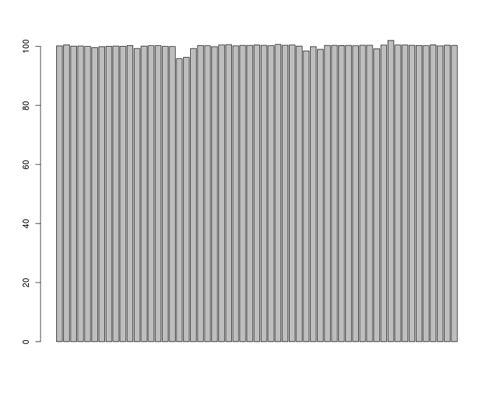 

```r
smellie.cenLR <- cenLR(smellie[,6:15])
smelliecen <- smellie
smelliecen[,6:15] <- smellie.cenLR$x.clr
head(smelliecen,1)
```

```
##   Sample Phase       Formation Longitude  Latitude     sio2       tio2
## 1 751.5a   pre Basaltic Shield -51.88255 -4.264456 2.910097 -0.6214748
##      Al2o3    Fe2O3       MnO       MgO      CaO      Na2O       K2O
## 1 1.783572 1.206887 -2.872767 0.7631735 1.244236 0.3259065 -2.090007
##        P2O5        Loi
## 1 -2.649623 -0.1597923
```

```r
smelliecen.melt <- melt(smelliecen,id=1:6,variable.name="Compound",value.name="LRC_Concentration")
head(smelliecen.melt,10)
```

```
##     Sample Phase        Formation Longitude  Latitude     sio2 Compound
## 1   751.5a   pre  Basaltic Shield -51.88255 -4.264456 2.910097     tio2
## 2   751.6b   pre  Basaltic Shield -52.70946 -5.128974 2.820914     tio2
## 3    791.2   pre  Basaltic Shield -53.33732 -5.567195 2.794357     tio2
## 4    791.5   pre  Basaltic Shield -53.79303 -5.694556 2.787703     tio2
## 5  B753.13   pre     Fumarole Bay -52.15172 -4.923939 2.768322     tio2
## 6  B760.38   pre     Fumarole Bay -50.91491 -4.779522 2.804505     tio2
## 7    786.6   pre     Fumarole Bay -51.43655 -4.978053 2.754515     tio2
## 8    793.9   pre     Fumarole Bay -53.09876 -5.656737 2.796068     tio2
## 9    867.3   pre     Fumarole Bay -51.44509 -2.391868 2.786570     tio2
## 10   751.2   syn Outer Coast Tuff -51.45331 -4.519212 2.846602     tio2
##    LRC_Concentration
## 1         -0.6214748
## 2         -0.4262413
## 3         -0.3516672
## 4         -0.3464901
## 5         -0.3521256
## 6         -0.4734254
## 7         -0.3862296
## 8         -0.2927181
## 9         -0.2818701
## 10        -0.5505409
```

```r
ggplot(data=smelliecen.melt) +
    geom_histogram(aes(x=LRC_Concentration)) +
    facet_wrap(~Compound,scales="free")
```

```
## stat_bin: binwidth defaulted to range/30. Use 'binwidth = x' to adjust this.
## stat_bin: binwidth defaulted to range/30. Use 'binwidth = x' to adjust this.
## stat_bin: binwidth defaulted to range/30. Use 'binwidth = x' to adjust this.
## stat_bin: binwidth defaulted to range/30. Use 'binwidth = x' to adjust this.
## stat_bin: binwidth defaulted to range/30. Use 'binwidth = x' to adjust this.
## stat_bin: binwidth defaulted to range/30. Use 'binwidth = x' to adjust this.
## stat_bin: binwidth defaulted to range/30. Use 'binwidth = x' to adjust this.
## stat_bin: binwidth defaulted to range/30. Use 'binwidth = x' to adjust this.
## stat_bin: binwidth defaulted to range/30. Use 'binwidth = x' to adjust this.
## stat_bin: binwidth defaulted to range/30. Use 'binwidth = x' to adjust this.
```

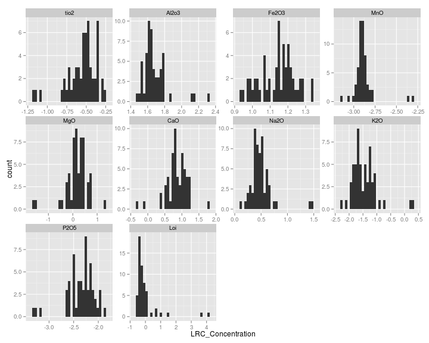 

```r
pairs(smelliecen[,-(1:6)])
```

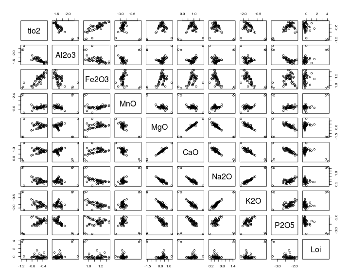 

## 2. LDA


```r
smelliecen.lda <- lda(smelliecen[,6:16], grouping=smelliecen$Phase)
```

```
## Warning in lda.default(x, grouping, ...): variables are collinear
```

```r
smelliecen.lda <- lda(prcomp(smelliecen[,6:16])$x, grouping=smelliecen$Phase)
```

```
## Error in lda.default(x, grouping, ...): variable 11 appears to be constant within groups
```

```r
smelliecen.lda <- lda(prcomp(smelliecen[,6:16])$x[,-11], grouping=smelliecen$Phase)
smelliecen.ldaclas <- predict(smelliecen.lda)$class
smelliecen.ldc <- predict(smelliecen.lda)$x
colorines <- as.character(mapvalues(smelliecen.ldaclas,from=c("pre","syn","post"),
                       to=c("green","red","blue")))
```

```r
plot(smelliecen.ldc, type="n", ,main="LDA Plot")
text(smelliecen.ldc,col=colorines, labels =smelliecen$Phase, cex=0.75)
legend("topright",title="Predicted Phases",title.col="black",legend=c("pre","syn","post"),text.col=c("green","red","blue"),bty="o",cex=0.75)
```

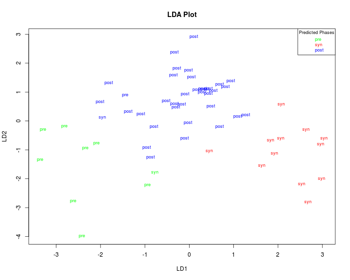 

Labels refer to observed eruptive phases, while colors refer to LDA-predicted eruptive phases. Note 3 discrepancies:

* 1 observed "syn" predicted as "pre"
* 1 observed "pre" predicted as "post"
* 1 observed "syn" predicted as "post".  


```r
plot(smelliecen.ldc,col=colorines,pch=" ",main="LDA Plot")
text(smelliecen.ldc,col=colorines, labels =smelliecen$Sample, cex=0.75)
legend("topright",title="Predicted Phases",title.col="black",legend=c("pre","syn","post"), pch=19,col=c("green","red","blue"),bty="o",cex=0.75)
```

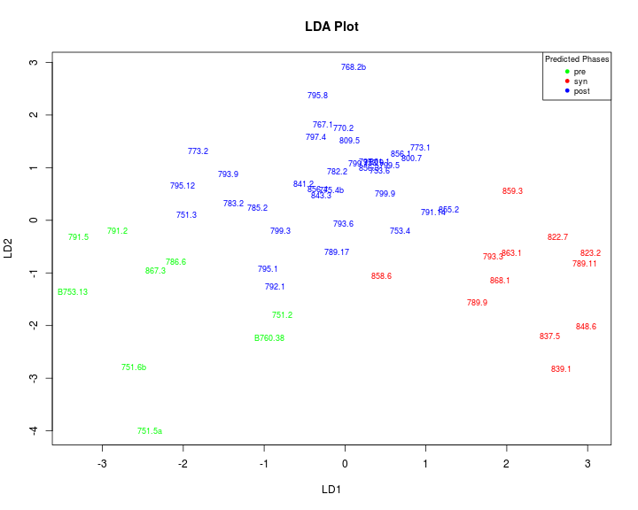 

According to this plot, the samples correspond to:

* 751.2 observed "syn" predicted as "pre"
* 793.9 observed "pre" predicted as "post"
* 751.3 observed "syn" predicted as "post"

### 2.2 Centroids


```r
ggplot(data=smelliecen.melt) +
    geom_boxplot(aes(x=Compound,y=LRC_Concentration)) +
    facet_wrap(~Phase)
```

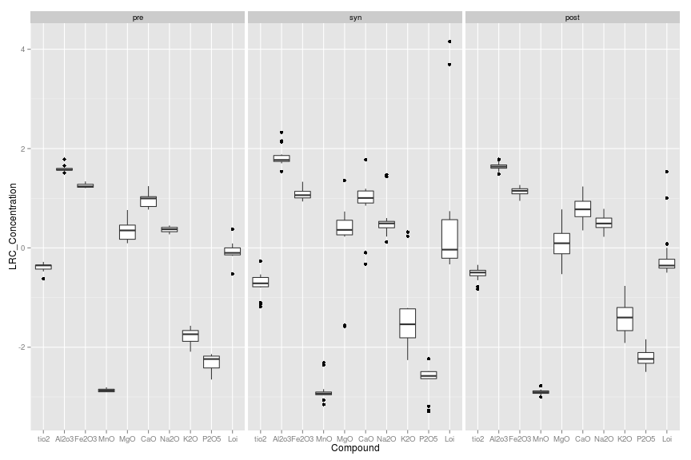 

```r
ggplot(data=smellie.melt) +
    geom_boxplot(aes(x=Compound,y=Concentration)) +
    facet_wrap(~Phase)
```

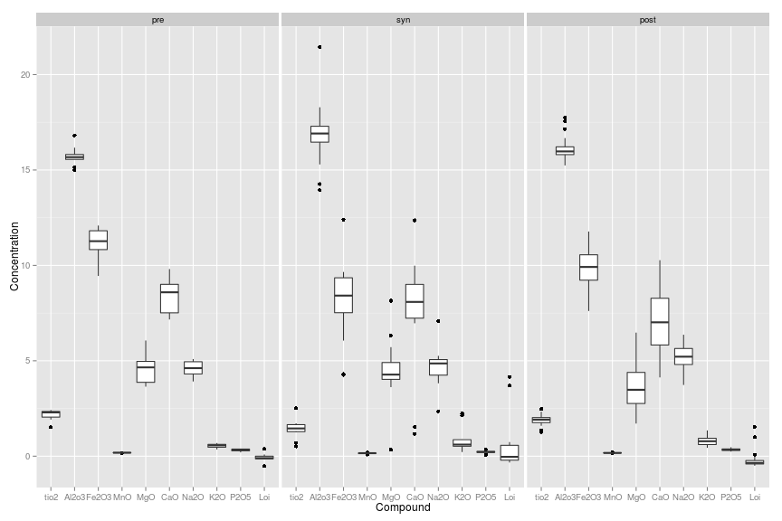 

## 3. MANOVA
Check multi-variate significance


```r
summary(manova(data.matrix(smelliecen[,-(1:5)]) ~ smelliecen$Phase),test="Wilks")
```

```
## Error in summary.manova(manova(data.matrix(smelliecen[, -(1:5)]) ~ smelliecen$Phase), : residuals have rank 10 < 11
```

This seems to be a consequence of the co-llinearity again. So we use the same solution:


```r
summary(manova(prcomp(smelliecen[,6:16])$x[,-11]~ smelliecen$Phase),test="Wilks")
```

```
##                  Df   Wilks approx F num Df den Df    Pr(>F)    
## smelliecen$Phase  2 0.18829   5.8705     20     90 1.795e-09 ***
## Residuals        54                                             
## ---
## Signif. codes:  0 '***' 0.001 '**' 0.01 '*' 0.05 '.' 0.1 ' ' 1
```

**Phase groups significantly differ in terms of Geochemical composition**

## 4. Selection of variables


```r
smelliecenHmat <- ldaHmat(smelliecen[,-(1:5)], grouping=smelliecen$Phase)
smelliecen.eleaps <- eleaps(smelliecenHmat$mat,kmin=2,kmax=10,H=smelliecenHmat$H,r=smelliecenHmat$r,crit="tau2",timelimit=15)
smelliecen.eleaps
```

Plot of quality of subsets


```r
par(mfrow=c(1,2))
plot(2:10,smelliecen.eleaps$bestvalues,xlab="Nb. of variables", ylab="Tau2 value")
plot(3:10,diff(smelliecen.eleaps$bestvalues)*100/smelliecen.eleaps$bestvalues[-9],
     xlab="Nb. of variables", ylab="Delta of Tau2")
```

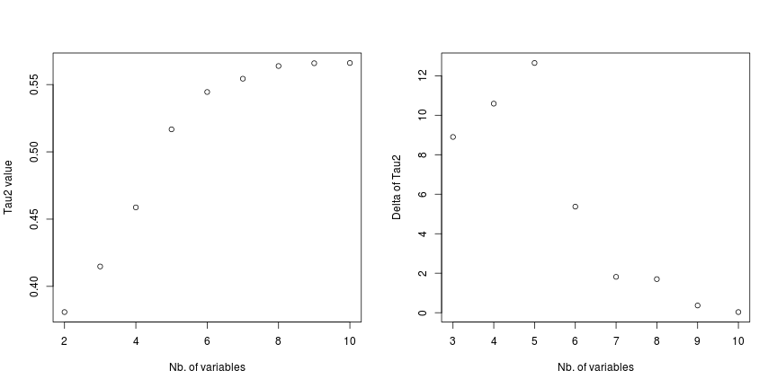 

Table of subsets


```r
options(width=180)
subsets <- smelliecen.eleaps$bestsets
subsets[subsets==0] <- NA
subsets2 <- names(smelliecen)[subsets+5]
dim(subsets2) <- dim(subsets)
colnames(subsets2) <- colnames(subsets)
subsets2
```

```
##       Var.1   Var.2   Var.3   Var.4   Var.5  Var.6  Var.7  Var.8  Var.9  Var.10
##  [1,] "Fe2O3" "P2O5"  NA      NA      NA     NA     NA     NA     NA     NA    
##  [2,] "MnO"   "K2O"   "P2O5"  NA      NA     NA     NA     NA     NA     NA    
##  [3,] "sio2"  "Al2o3" "Na2O"  "K2O"   NA     NA     NA     NA     NA     NA    
##  [4,] "sio2"  "Al2o3" "Na2O"  "K2O"   "P2O5" NA     NA     NA     NA     NA    
##  [5,] "sio2"  "Al2o3" "Fe2O3" "Na2O"  "K2O"  "P2O5" NA     NA     NA     NA    
##  [6,] "sio2"  "Al2o3" "Fe2O3" "MnO"   "Na2O" "K2O"  "P2O5" NA     NA     NA    
##  [7,] "sio2"  "tio2"  "Al2o3" "Fe2O3" "MnO"  "Na2O" "K2O"  "P2O5" NA     NA    
##  [8,] "sio2"  "Al2o3" "Fe2O3" "MgO"   "CaO"  "Na2O" "K2O"  "P2O5" "Loi"  NA    
##  [9,] "tio2"  "Al2o3" "Fe2O3" "MnO"   "MgO"  "CaO"  "Na2O" "K2O"  "P2O5" "Loi"
```

```r
options(width=80)
```

```r
ggplot(data=data.frame(smelliecen.ldc,Phase=smelliecen$Phase)) +
    geom_text(aes(x=LD1,y=LD2,label=Phase,col=Phase),size=3) +
    ggtitle("LDA with all variables")
for(i in c(5,7,10)){
    selvar <- smelliecen.eleaps$bestsets[i-1,]
    selvar <- selvar[selvar!=0]+5
    delme <- paste(names(smelliecen)[selvar], collapse=" ")
    smelliecensub.lda <- lda(smelliecen[,selvar],grouping=smelliecen$Phase)
    smelliecensub.ldc <- data.matrix(predict(smelliecensub.lda)$x)
    smelliecensub.ldc <- data.frame(smelliecen[,1:5],smelliecensub.ldc)
    print(ggplot(data=smelliecensub.ldc) +
              geom_text(aes(x=LD1,y=LD2,label=Phase,col=Phase),size=3) +
              ggtitle(paste("LDA with", delme)))
}
```

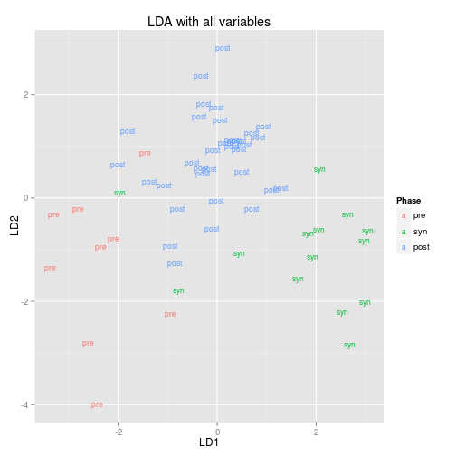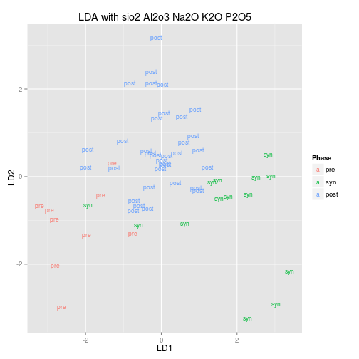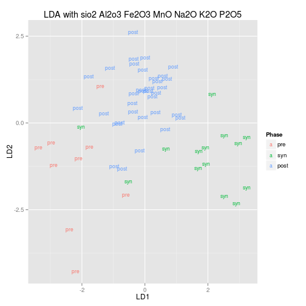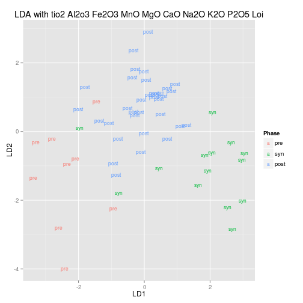

